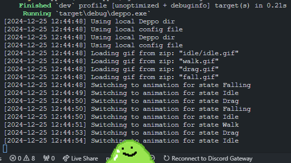
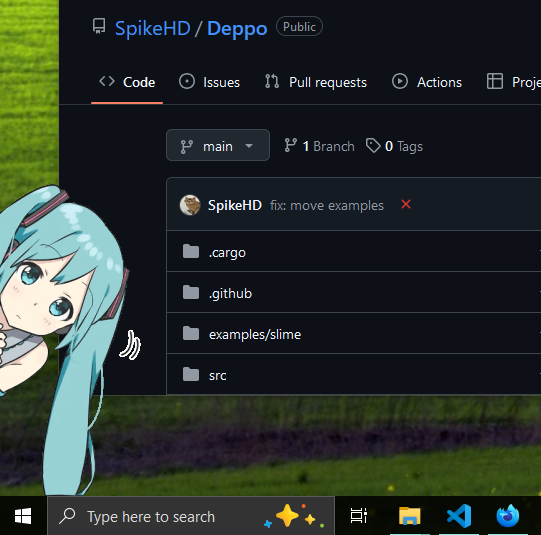

  <h1>Deppo</h1>
  

    Little friends on your computer!!!
  

  <a href="https://discord.gg/agQ9mRdHMZ">
    https://discord.gg/agQ9mRdHMZ
  </a>

 
 

 
 
 
 

# Table of Contents

* [Table of Contents](#table-of-contents)
* [Download](#download)
* [What is Deppo?](#what-is-deppo)
* [Video Demo](#video-demo)
* [Quickstart](#quickstart)
* [Make your own!](#make-your-own)
* [Building](#building)
  * [Requirements](#requirements)
  * [Steps](#steps)
* [TODO](#todo)
* [Contributing](#contributing)

# Download

~~All downloads can be found on the [releases page](https://github.com/SpikeHD/Deppo/releases). If you're unsure, download the **Windows x86** version.~~

Deppo is still in development, but you can test it using the following links!

<table align="center">
  <tr>
    <th>
      
    </th>
    <th>
      
    </th>
    <th>
      
    </th>
  </tr>

  <tr>
    <td width="30%">
      

        <a href="https://nightly.link/SpikeHD/Deppo/workflows/build/main/Deppo%20Windows%20x86_64.zip">x86_64</a>
        |
        <a href="https://nightly.link/SpikeHD/Deppo/workflows/build/main/Deppo%20Windows%20ARM64.zip">ARM</a>
      

    </td>
    <td width="30%">
      

        <a href="https://nightly.link/SpikeHD/Deppo/workflows/build/main/Deppo%20macOS%20x86_64.zip">x86_64</a>
        |
        <a href="https://nightly.link/SpikeHD/Deppo/workflows/build/main/Deppo%20macOS%20ARM64.zip">ARM</a>
      

    </td>
    <td width="30%">
      

        <a href="https://nightly.link/SpikeHD/Deppo/workflows/build/main/Deppo%20Linux%20x86_64.zip">x86_64</a>
      

    </td>
  </tr>
</table>

# What is Deppo?

Deppo is a highly customizable desktop companion engine! With Deppo, you can use, create, and share little friends that live on your computer screen, all while using minimal resources. Deppos can move around, be dragged, and even thrown around!

Deppos are not just critters of course. With Deppo, you can also display regular GIFs or images on your screen with very little effort. You can configure and disable movement behaviours, drag-ability, and everything else you may or may not want.

# Demonstration

## Video Demo

  <video width="75%" src="https://github.com/SpikeHD/Deppo/assets/25207995/86ba9087-2c57-46be-83bf-b040e1c0f9c6" />
  </video>

(Excuse the programmer art)

## Screenshots

<table align="center">
  <tr>
    <td align="center">
      Deppos hang out anywhere on your screen, and sit right on your taskbar, if you let them! 
    </td>
    <td align="center">
      
    </td>
  </tr>

  <tr>
    <td align="center">
      Deppos can also be static images!
       
       
      (If somebody knows the artist, let me know and I'll credit them here)
    </td>
    <td align="center">
      
    </td>
  </tr>
</table>

# Quickstart

1. After downloading Deppo and opening it for the first time, you will be greeted with a menu.
2. Click "Open Deppos Folder" to open the folder where Deppos are stored. **This is where you put folders/zip files
containing each Deppo!**
3. When you add Deppos, restart the program and you should see them listed. **Click on one, then restart the program again!**

# Make Your Own!

You can find a comprehesive guide and reference for creating your own Deppo in the [CREATING.md](CREATING.md) file.

# Building

## Requirements

* [Rust and Cargo](https://www.rust-lang.org/tools/install)

## Steps

1. Clone the repository
2. Run `cargo build --release`
3. The built binary will be in `target/release`

# TODO

* [ ] Transition animations
* [x] Single-file loading (basically just renamed `.zip` files)
* [x] "Throwing" with mouse drag
* [x] UI for choosing Deppos
* [x] Configuration options
* [ ] Click behaviour
* [ ] ARM Linux support
* [ ] Example Deppos
* [ ] Always-on-top
* [ ] More documentation

# Contributing

Issues, PRs, etc. are all welcome!
